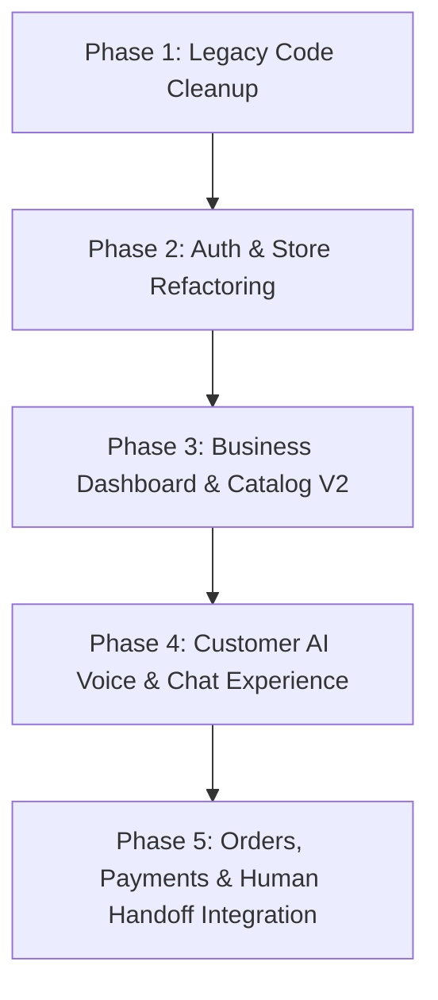

# Voxy V1 → V2 Legacy Audit & Architecture Migration Plan

**Date:** September 4, 2026  
**Auditor:** Antigravity AI  
**Scope:** Full codebase audit (`src/`, `prisma/`, `public/docs/`, routes, components, state, hooks, and API endpoints)

---

## 1. Executive Summary

### The Core Shift: V1 Chatbot vs. V2 AI Employee

| Attribute | Voxy V1 (Legacy) | Voxy V2 (Next-Gen AI Employee) |
| :--- | :--- | :--- |
| **Core Concept** | Static FAQ Chatbot / Multi-party Messaging Platform | Autonomous Voice & Text AI Employee / Storefront Agent |
| **User Roles** | 3 Distinct user roles: `CUSTOMER`, `BUSINESS`, `ADMIN` with customer logins | Single authenticated role: `BUSINESS` (Owners / Staff). Customers are end-users interacting via public AI links/widgets (no customer sign-up needed) |
| **Customer Experience** | Dedicated `/customer/*` dashboard, saved chats, customer auth | Instant voice/chat web agent via shareable link `voxy.ai/[slug]` or embed |
| **Capabilities** | Basic text prompting, manual bot widget styling | Natural voice conversations (WebRTC / ElevenLabs / Gemini Live), product catalog recommendations, automated order capture, dynamic payment link generation, payment verification, and automated human handoff |
| **Data Flow** | Fragmented Supabase/Postgres hybrid queries, mock data | Prisma ORM with unified Postgres database (`prisma/schema.prisma`), server actions & structured REST endpoints (`public/docs/api.md`) |

---

## 2. Inventory & Audit of Codebase

### A. Routes & Pages (`src/app/`)

| Path | Status | Action | Rationale |
| :--- | :--- | :--- | :--- |
| `src/app/customer/*` | **Legacy V1** | ❌ **REMOVE** | V2 has no customer accounts/portals. Customers interact directly with business agents via public links. |
| `src/app/chat/*` | **Legacy V1** | ❌ **REMOVE** | Old static chat room interface. Replaced by `src/app/business/[businessSlug]` or dedicated agent page. |
| `src/app/business/dashboard/` | Partially V2 | 🔄 **REFACTOR** | Upgrade analytics to show AI Employee metrics: voice minutes, live orders, conversion rate, escalations. |
| `src/app/business/conversation/` | Partially V2 | 🔄 **REFACTOR** | Upgrade to Live AI Conversation Feed with live sentiment, audio replay, transcripts, and human takeover trigger. |
| `src/app/business/profile/` | Active | 🔄 **REFACTOR** | Align with V2 Business Profile (Business type, catalog, operating hours, AI tone, fallback phone/email). |
| `src/app/business/settings/` | Active | 🔄 **REFACTOR** | Modernize settings: Voice selection (ElevenLabs IDs), escalation webhooks, payment keys (Paystack/Flutterwave). |
| `src/app/business/wallet/` | Active | 🔄 **REFACTOR** | Align with V2 billing & usage (voice minutes balance, top-up, subscription tier). |
| `src/app/business/[businessSlug]/` | Active / V2 | 🔄 **REFACTOR / EXPAND** | The main customer-facing AI interface (Voice + Chat, cart drawer, checkout modal). |
| `src/app/login/`, `src/app/register/` | Active | 🔄 **REFACTOR** | Remove role selector (no customer registration). Only business owner signup & onboarding. |
| `src/app/admin/*` | Legacy / Internal | ⚠️ **ISOLATE / DEPRECATE** | Internal backoffice; keep clean or isolate from customer/business client bundles. |

---

### B. Components (`src/components/`)

| Component Directory | Files | Action | Rationale |
| :--- | :--- | :--- | :--- |
| `src/components/chat/` | `ChatWindow.jsx`, `MessageList.jsx`, `ChatInput.jsx`, etc. | ❌ **REMOVE / REPLACE** | Built around legacy chat rooms. Replace with modern voice-first / chat multimodal component with wave visualizer. |
| `src/components/business/` | `ChatbotCustomization.jsx`, `BotPreview.jsx` | 🔄 **REFACTOR** | Refactor from "Chatbot widget style" to "AI Employee Persona & Voice Configuration". |
| `src/components/admin/` | Admin panels | ⚠️ **ISOLATE** | Separate from core business dashboard bundle. |
| `src/components/conversation/` | `ConversationList.jsx`, `ConversationDetail.jsx` | 🔄 **REFACTOR** | Enhance with AI actions (Order placed, Payment verified, Handoff to human, Transcript tags). |
| `src/components/dashboard/` | Metric cards, charts | 🔄 **REFACTOR** | Update metric cards to V2: Calls Handled, Orders Captured, Revenue Assisted, Escalation Rate. |
| `src/components/ui/` | Dialog, Button, Card, Dropdown, etc. | ✅ **KEEP** | Standard reusable Radix / Tailwind UI components. |
| `src/components/layout/` | `Sidebar.jsx`, `Navbar.jsx` | 🔄 **REFACTOR** | Clean up navigation links (remove legacy customer/chat references; add Products/Orders/AI Agent tabs). |

---

### C. State, Hooks & Libs (`src/hooks/`, `src/store/`, `src/lib/`)

| File | Type | Action | Rationale |
| :--- | :--- | :--- | :--- |
| `src/lib/supabase.js` | Database / Auth | ❌ **REMOVE / DEPRECATE** | Database is now PostgreSQL via Prisma (`DATABASE_URL` in `.env.local`). Supabase client is redundant and causes confusion. |
| `src/lib/mockData.js` | Data | ❌ **REMOVE** | Legacy V1 mock data with obsolete schemas. Replaced by Prisma models and real API fixtures. |
| `src/hooks/useAuth.js` | Auth Hook | 🔄 **REFACTOR** | Simplify to JWT/session-based business auth without legacy customer multi-role branches. |
| `src/hooks/useVoiceRecorder.js` | Audio Hook | 🔄 **REFACTOR** | Optimize for real-time streaming audio to backend / STT / WebRTC. |
| `src/hooks/useAudioManager.js` | Audio Hook | ✅ **KEEP / ENHANCE** | Handle ElevenLabs/Gemini audio playback with smooth visualizer bindings. |
| `src/store/useUserStore.js` | Global State | 🔄 **REFACTOR** | Update store schema to hold business profile, agent configuration, active voice session state, and cart. |
| `src/lib/ai-context.js` | AI Engine | 🔄 **REFACTOR** | Upgrade to V2 prompt orchestration: tool calling for products, order creation, payment link generation, and handoff. |

---

### D. Backend API Routes (`src/app/api/` & `prisma/schema.prisma`)

| Area | Current Status | V2 Requirement |
| :--- | :--- | :--- |
| **Authentication** | Basic `/api/auth/*` | Clean JWT cookie/header session for Business users only. |
| **AI Agent Orchestration** | Legacy prompt endpoints | `/api/v2/ai/converse` or WebSocket/WebRTC for voice + tool-calling (order, product search, payment link). |
| **Products & Catalog** | Incomplete | Full CRUD `/api/products` (Name, Price, Inventory, Images, Description) for AI to recommend & sell. |
| **Orders & Payments** | Partial | `/api/orders` + Paystack/Flutterwave webhook integration for auto-verification and AI confirmation. |
| **Escalations & Handoff** | Missing | `/api/conversations/[id]/escalate` (Notifies business via WhatsApp/SMS/Email when human intervention is needed). |

---

## 3. Decision Matrix: Code Removal & Refactor Plan

### 1. Files to Delete (Dead Legacy Code)
- `src/app/customer/` (Entire folder and all sub-routes)
- `src/app/chat/` (Entire legacy chat directory)
- `src/lib/mockData.js`
- `src/lib/supabase.js` (Unless specifically needed for storage bucket; replace auth/db with Prisma)

### 2. Files to Refactor (V1 → V2 Conversion)
- `src/components/layout/Sidebar.jsx` → Streamlined V2 nav: Overview, AI Employee, Live Conversations, Products & Menu, Orders & Payments, Analytics, Settings.
- `src/components/business/` → Transform chatbot configuration into AI Voice & Persona Customization.
- `src/app/business/[businessSlug]/page.jsx` → Transform into full-screen interactive voice/chat customer experience with live cart & instant checkout.
- `src/hooks/useAuth.js` & `src/store/useUserStore.js` → Clean business auth.

### 3. Files to Create (V2 Core Additions)
- `src/components/agent/VoiceOrb.jsx` & `AudioVisualizer.jsx` (Modern fluid waveform / glowing orb UI for voice calls).
- `src/components/agent/ProductCard.jsx` & `CartDrawer.jsx` (In-conversation interactive shopping experience).
- `src/components/agent/PaymentModal.jsx` (Instant checkout & live payment verification).
- `src/components/conversation/HumanHandoffBanner.jsx` (Live escalation badge & alert).

---

## 4. Phased Execution Roadmap

1. **Phase 1: Legacy Pruning**
   - Safely remove `/customer`, `/chat`, and unneeded V1 mock files.
   - Clean up imports and build checks (`npm run build` validation).

2. **Phase 2: Unified Business Auth & Navigation**
   - Refactor `useAuth.js`, `Sidebar.jsx`, and dashboard layouts.
   - Ensure clean session management without legacy role checks.

3. **Phase 3: AI Employee Configuration & Catalog Management**
   - Build product/service management interface.
   - Build AI voice persona, prompt tuning, and working hours settings.

4. **Phase 4: Customer-Facing Public AI Agent Interface (`/[businessSlug]`)**
   - Implement fluid Voice + Text interface with real-time feedback.
   - Connect ElevenLabs / Gemini audio streaming.

5. **Phase 5: Actions Engine (Orders, Payments & Live Escalations)**
   - Wire tool calling: AI creates orders, shares payment links, verifies status, and triggers human handoff when requested.
